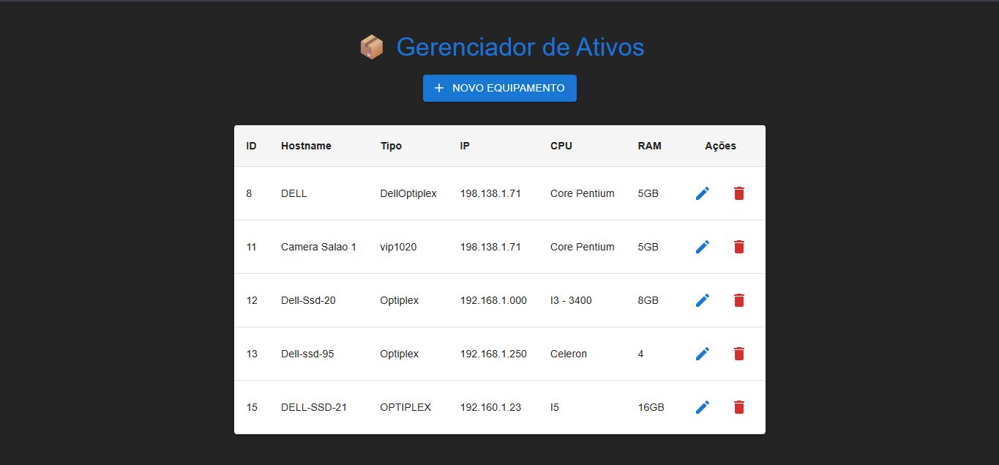

# 📦 Asset Manager (Gerenciador de Ativos de TI)

> Projeto Fullstack desenvolvido para gerenciar o inventário de equipamentos (Notebooks, Servidores) de uma empresa.

## 📸 Demonstração



## 🚀 Tecnologias Utilizadas

Este projeto foi construído do zero utilizando a stack moderna de desenvolvimento web:

### Backend (API REST)
- **Node.js & TypeScript:** Para segurança de tipos e escalabilidade.
- **Express:** Framework para construção das rotas da API.
- **PostgreSQL:** Banco de dados relacional robusto.
- **Docker:** Utilizado para containerizar o banco de dados, garantindo que o ambiente seja replicável em qualquer máquina.
- **CORS & Axios:** Para comunicação segura entre Front e Back.

### Frontend (SPA)
- **React.js (Vite):** Para uma interface rápida e reativa.
- **Material UI (MUI):** Biblioteca de componentes para um design system profissional e responsivo.
- **React Hooks:** Uso de `useState` e `useEffect` para gerenciamento de estado e ciclo de vida.

---

## ⚙️ Funcionalidades (CRUD Completo)

O sistema permite o controle total do inventário:
- ✅ **Create:** Cadastro de novos equipamentos via Modal.
- ✅ **Read:** Listagem de ativos em Tabela Data Grid.
- ✅ **Update:** Edição de informações com reaproveitamento de formulário.
- ✅ **Delete:** Remoção de itens com confirmação de segurança (`window.confirm`).

---

## 🧠 Aprendizados e Desafios

Durante o desenvolvimento, foquei em resolver problemas reais de arquitetura:

1.  **Arquitetura em Camadas:** Separação clara entre responsabilidades do Banco de Dados, API (Backend) e Interface (Frontend).
2.  **Tratamento de Erros:** Implementação de blocos `try/catch` para garantir que o sistema lide com falhas de rede ou banco de dados sem travar a aplicação.
3.  **Gerenciamento de Rotas:** Organização correta dos verbos HTTP (GET, POST, PUT, DELETE) para evitar conflitos e *nested routes*.
4.  **UX/UI:** Uso de Modais e Feedbacks visuais para melhorar a experiência do usuário final.

---

## 🛠️ Como rodar o projeto localmente

### Pré-requisitos
- Node.js
- Docker (para o banco de dados)

### Passo a passo

```bash
1. **Clone o repositório**
   git clone [https://github.com/SEU-USUARIO/asset-manager.git](https://github.com/SEU-USUARIO/asset-manager.git)


2. **Inicie o Banco de Dados**
   docker run --name pg-docker -e POSTGRES_PASSWORD=docker -p 5432:5432 -d postgres

3. **Backend**
    cd backend
    npm install
    npm run dev

4. **FrontEnd**
    cd frontend
    npm install
    npm run dev
```
---
